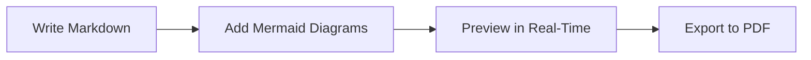
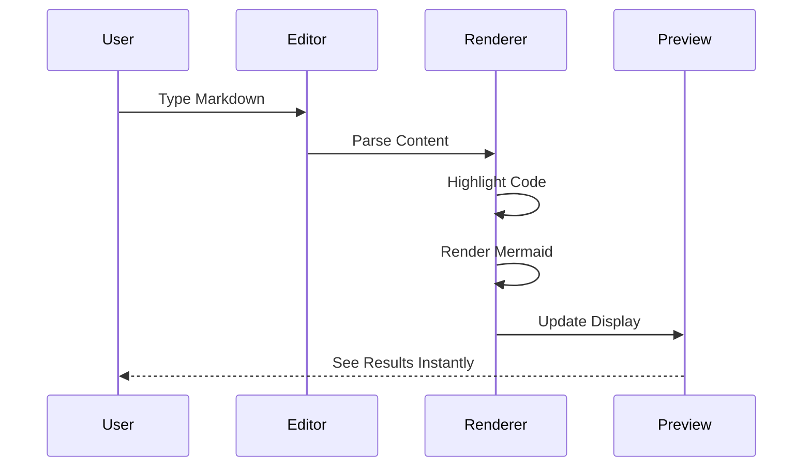

# About Merview

[← Back to Welcome](https://merview.com)

---

## What is Merview?

**Merview** is a client-side Markdown editor and previewer with first-class support for [Mermaid](https://mermaid.js.org/) diagrams. It's designed for developers, technical writers, and anyone who needs to create beautiful documentation with embedded diagrams.



## Key Features

### Privacy-First Design

Everything runs in your browser. Your documents never leave your machine unless you explicitly share them.

- **No server-side processing** - all rendering happens locally
- **No tracking or analytics** - we don't know what you write
- **No account required** - just open and start writing
- **Auto-save to localStorage** - your work persists across sessions

### Mermaid Diagram Support

Full support for Mermaid.js diagrams including:

| Diagram Type | Description |
|--------------|-------------|
| Flowcharts | Process flows and decision trees |
| Sequence Diagrams | Interaction between components |
| Class Diagrams | Object-oriented design |
| State Diagrams | State machines and transitions |
| Entity Relationship | Database design |
| Gantt Charts | Project timelines |
| Pie Charts | Data visualization |
| Git Graphs | Branch and commit visualization |
| Mindmaps | Hierarchical brainstorming |
| Timeline | Chronological events |

### Professional Themes

Choose from **37 professional document styles** to make your documents look polished:

- **Clean** - Minimal and modern
- **Academic** - Perfect for papers and reports
- **GitHub** - Familiar GitHub-flavored styling
- **Dark themes** - Easy on the eyes
- **And many more...**

[View Theme Guide →](https://merview.com/?url=https://raw.githubusercontent.com/mickdarling/merview/main/docs/themes.md)

### Code Syntax Highlighting

Beautiful syntax highlighting for **190+ programming languages** powered by highlight.js:

```javascript
// JavaScript example
const greet = (name) => `Hello, ${name}!`;
console.log(greet('World'));
```

```python
# Python example
def fibonacci(n):
    if n <= 1:
        return n
    return fibonacci(n-1) + fibonacci(n-2)
```

### Export Options

- **Print to PDF** - Use your browser's print dialog
- **Print in New Tab** - Preview before printing
- **Save as .md** - Download your markdown file

## How It Works



1. **Write** in the left pane using standard Markdown syntax
2. **Preview** updates in real-time in the right pane
3. **Style** your document using the theme selectors
4. **Export** when you're ready to share

## Technology

Merview is built with:

- **[marked](https://marked.js.org/)** - Fast Markdown parsing
- **[highlight.js](https://highlightjs.org/)** - Syntax highlighting
- **[Mermaid](https://mermaid.js.org/)** - Diagram rendering
- **[CodeMirror](https://codemirror.net/)** - Editor component
- **[DOMPurify](https://github.com/cure53/DOMPurify)** - XSS protection

## Open Source

Merview is open source under the **AGPL-3.0 license**.

- **Source Code**: [github.com/mickdarling/merview](https://github.com/mickdarling/merview)
- **Report Issues**: [GitHub Issues](https://github.com/mickdarling/merview/issues)
- **Contribute**: [Contributing Guide](https://merview.com/?url=https://raw.githubusercontent.com/mickdarling/merview/main/docs/contributing.md)

---

## Navigation

- [← Back to Welcome](https://merview.com)
- [Theme Guide](https://merview.com/?url=https://raw.githubusercontent.com/mickdarling/merview/main/docs/themes.md)
- [Security](https://merview.com/?url=https://raw.githubusercontent.com/mickdarling/merview/main/docs/security.md)
- [Contributing](https://merview.com/?url=https://raw.githubusercontent.com/mickdarling/merview/main/docs/contributing.md)
- [Support the Project](https://merview.com/?url=https://raw.githubusercontent.com/mickdarling/merview/main/docs/sponsor.md)
