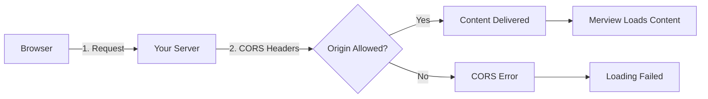

# CORS Configuration

[← Back to Welcome](/?sample)

---

When hosting Merview or serving markdown files from your own server, you may encounter CORS (Cross-Origin Resource Sharing) errors. This guide explains what CORS is and how to configure it for various hosting platforms.



---

## What is CORS?

CORS (Cross-Origin Resource Sharing) is a security feature built into web browsers. When a web page (like Merview) tries to load a file from a different website, the browser checks if that website allows it.

**In simple terms:**
- Your browser protects you by blocking requests between different websites
- Servers must explicitly say "yes, this website can access my files"
- This prevents malicious sites from stealing data from other sites

**When you'll see CORS errors:**
- Loading markdown files from your own server
- Loading custom CSS themes from external sources
- Fetching content from APIs or CDNs

---

## Platform-Specific Configuration

### Nginx

Add to your server block or location block:

```nginx
# Allow specific origin (recommended)
add_header 'Access-Control-Allow-Origin' 'https://merview.app';
add_header 'Access-Control-Allow-Methods' 'GET, OPTIONS';
add_header 'Access-Control-Allow-Headers' 'Content-Type';

# Or allow all origins (use with caution)
# add_header 'Access-Control-Allow-Origin' '*';

# Handle preflight requests
if ($request_method = 'OPTIONS') {
    add_header 'Access-Control-Allow-Origin' 'https://merview.app';
    add_header 'Access-Control-Allow-Methods' 'GET, OPTIONS';
    add_header 'Access-Control-Max-Age' 1728000;
    add_header 'Content-Type' 'text/plain; charset=utf-8';
    add_header 'Content-Length' 0;
    return 204;
}
```

**Full server configuration example:**

```nginx
server {
    listen 80;
    server_name docs.example.com;

    location ~ \.(md|markdown)$ {
        root /var/www/docs;
        add_header 'Access-Control-Allow-Origin' 'https://merview.app';
        add_header 'Access-Control-Allow-Methods' 'GET, OPTIONS';
        add_header 'Content-Type' 'text/markdown; charset=utf-8';
    }
}
```

---

### Apache

Add to your `.htaccess` file or VirtualHost configuration:

```apache
# Allow specific origin (recommended)
Header set Access-Control-Allow-Origin "https://merview.app"
Header set Access-Control-Allow-Methods "GET, OPTIONS"
Header set Access-Control-Allow-Headers "Content-Type"

# Or allow all origins (use with caution)
# Header set Access-Control-Allow-Origin "*"

# Handle preflight requests
<IfModule mod_rewrite.c>
    RewriteEngine On
    RewriteCond %{REQUEST_METHOD} OPTIONS
    RewriteRule ^(.*)$ $1 [R=204,L]
</IfModule>
```

**For markdown files specifically:**

```apache
<FilesMatch "\.(md|markdown)$">
    Header set Access-Control-Allow-Origin "https://merview.app"
    Header set Content-Type "text/markdown; charset=utf-8"
</FilesMatch>
```

---

### Cloudflare

Cloudflare offers multiple ways to configure CORS:

#### Method 1: Transform Rules (Recommended)

1. Log into Cloudflare Dashboard
2. Select your domain
3. Go to **Rules** → **Transform Rules** → **Modify Response Header**
4. Create a new rule:

```
Rule name: Allow CORS for Merview
When incoming requests match: Custom filter expression
  - Field: Hostname, Operator: equals, Value: your-domain.com
Then modify header:
  - Set static → Access-Control-Allow-Origin: https://merview.app
  - Set static → Access-Control-Allow-Methods: GET, OPTIONS
```

#### Method 2: Cloudflare Workers

```javascript
addEventListener('fetch', event => {
  event.respondWith(handleRequest(event.request))
})

async function handleRequest(request) {
  const response = await fetch(request)
  const newResponse = new Response(response.body, response)

  newResponse.headers.set('Access-Control-Allow-Origin', 'https://merview.app')
  newResponse.headers.set('Access-Control-Allow-Methods', 'GET, OPTIONS')

  return newResponse
}
```

---

### AWS S3

#### Static Website Hosting

1. Go to your S3 bucket
2. Navigate to **Permissions** → **CORS configuration**
3. Add the following JSON:

```json
[
    {
        "AllowedHeaders": ["*"],
        "AllowedMethods": ["GET", "HEAD"],
        "AllowedOrigins": ["https://merview.app"],
        "ExposeHeaders": [],
        "MaxAgeSeconds": 3600
    }
]
```

**Allow all origins (less secure):**

```json
[
    {
        "AllowedHeaders": ["*"],
        "AllowedMethods": ["GET", "HEAD"],
        "AllowedOrigins": ["*"],
        "ExposeHeaders": [],
        "MaxAgeSeconds": 3600
    }
]
```

---

### GitHub Pages

GitHub Pages automatically serves content with CORS headers that allow all origins:

```
Access-Control-Allow-Origin: *
```

**No configuration needed!** This is one of the easiest ways to host markdown files for Merview.

**Example URL format:**
```
https://username.github.io/repository/docs/file.md
```

---

### GitLab Pages

Similar to GitHub Pages, GitLab Pages serves content with permissive CORS headers by default:

```
Access-Control-Allow-Origin: *
```

**No configuration needed!**

**Example URL format:**
```
https://username.gitlab.io/project/docs/file.md
```

---

### Caddy

Caddy makes CORS configuration simple with the `header` directive:

```caddy
docs.example.com {
    root * /var/www/docs
    file_server

    header {
        Access-Control-Allow-Origin "https://merview.app"
        Access-Control-Allow-Methods "GET, OPTIONS"
        Access-Control-Allow-Headers "Content-Type"
    }

    @markdown {
        path *.md *.markdown
    }
    header @markdown Content-Type "text/markdown; charset=utf-8"
}
```

**Allow all origins:**

```caddy
docs.example.com {
    root * /var/www/docs
    file_server

    header Access-Control-Allow-Origin "*"
}
```

---

### Node.js / Express

Install the CORS middleware:

```bash
npm install cors
```

**Basic usage:**

```javascript
const express = require('express');
const cors = require('cors');
const app = express();

// Allow all origins
app.use(cors());

// Or allow specific origin
app.use(cors({
    origin: 'https://merview.app',
    methods: ['GET', 'OPTIONS'],
    allowedHeaders: ['Content-Type']
}));

// Serve markdown files
app.use('/docs', express.static('docs'));

app.listen(3000);
```

**Manual configuration without middleware:**

```javascript
const express = require('express');
const app = express();

app.use((req, res, next) => {
    res.header('Access-Control-Allow-Origin', 'https://merview.app');
    res.header('Access-Control-Allow-Methods', 'GET, OPTIONS');
    res.header('Access-Control-Allow-Headers', 'Content-Type');

    if (req.method === 'OPTIONS') {
        return res.sendStatus(204);
    }

    next();
});

app.use('/docs', express.static('docs'));
app.listen(3000);
```

---

### Python / Flask

Install Flask-CORS:

```bash
pip install flask-cors
```

**Basic usage:**

```python
from flask import Flask
from flask_cors import CORS

app = Flask(__name__)

# Allow all origins
CORS(app)

# Or allow specific origin
CORS(app, origins=["https://merview.app"])

@app.route('/docs/<path:filename>')
def serve_markdown(filename):
    return send_from_directory('docs', filename, mimetype='text/markdown')

if __name__ == '__main__':
    app.run()
```

**Manual configuration without library:**

```python
from flask import Flask, send_from_directory, make_response

app = Flask(__name__)

@app.after_request
def after_request(response):
    response.headers.add('Access-Control-Allow-Origin', 'https://merview.app')
    response.headers.add('Access-Control-Allow-Methods', 'GET, OPTIONS')
    response.headers.add('Access-Control-Allow-Headers', 'Content-Type')
    return response

@app.route('/docs/<path:filename>')
def serve_markdown(filename):
    response = make_response(send_from_directory('docs', filename))
    response.headers['Content-Type'] = 'text/markdown; charset=utf-8'
    return response

if __name__ == '__main__':
    app.run()
```

---

## Security Considerations

### Wildcard (`*`) vs Specific Origins

**Using `*` (all origins):**

```
Access-Control-Allow-Origin: *
```

✅ **Good for:**
- Public documentation
- Open data APIs
- Content meant to be embedded anywhere
- GitHub/GitLab Pages (default behavior)

⚠️ **Avoid when:**
- Serving private or sensitive content
- Requiring authentication
- Concerned about bandwidth abuse
- Content is not meant to be public

**Using specific origins:**

```
Access-Control-Allow-Origin: https://merview.app
```

✅ **Good for:**
- Controlled access
- Private documentation
- Authenticated content
- Production environments

⚠️ **Limitations:**
- Only one origin per response (use server logic for multiple)
- Must maintain allowlist
- Breaks if users run local copies

### Multiple Allowed Origins

If you need to allow multiple origins (e.g., `merview.app` and `localhost`):

**Nginx:**

```nginx
map $http_origin $cors_origin {
    default "";
    "https://merview.app" "https://merview.app";
    "http://localhost:5000" "http://localhost:5000";
    "http://127.0.0.1:5000" "http://127.0.0.1:5000";
}

server {
    location / {
        add_header 'Access-Control-Allow-Origin' $cors_origin;
    }
}
```

**Node.js/Express:**

```javascript
const allowedOrigins = [
    'https://merview.app',
    'http://localhost:5000',
    'http://127.0.0.1:5000'
];

app.use(cors({
    origin: function (origin, callback) {
        if (!origin || allowedOrigins.includes(origin)) {
            callback(null, true);
        } else {
            callback(new Error('Not allowed by CORS'));
        }
    }
}));
```

---

## Testing CORS Configuration

### Browser DevTools

1. Open browser Developer Tools (F12)
2. Go to the **Network** tab
3. Load your content in Merview
4. Click on the request
5. Check **Response Headers** for:

```
Access-Control-Allow-Origin: https://merview.app
Access-Control-Allow-Methods: GET, OPTIONS
```

### Command Line (curl)

Test CORS headers with curl:

```bash
# Test GET request
curl -H "Origin: https://merview.app" \
     -H "Access-Control-Request-Method: GET" \
     -H "Access-Control-Request-Headers: Content-Type" \
     -X OPTIONS \
     --verbose \
     https://your-server.com/file.md
```

**Look for these headers in the response:**

```
Access-Control-Allow-Origin: https://merview.app
Access-Control-Allow-Methods: GET, OPTIONS
```

### Online Tools

- [CORS Tester](https://www.test-cors.org/)
- [Enable CORS Check](https://enable-cors.org/check.html)

**Example test:**
1. Enter your markdown file URL
2. Enter origin: `https://merview.app`
3. Click "Send Request"
4. Verify CORS headers are present

---

## Common CORS Issues

### Issue: "No 'Access-Control-Allow-Origin' header present"

**Cause:** Server not configured for CORS

**Solution:** Add CORS headers using one of the configurations above

---

### Issue: "CORS policy: Origin 'https://merview.app' is not allowed"

**Cause:** Origin not in allowlist

**Solution:** Add `https://merview.app` to your allowed origins list

---

### Issue: "Content-Type not allowed by CORS"

**Cause:** Content-Type header not in allowed headers

**Solution:** Add to allowed headers:

```
Access-Control-Allow-Headers: Content-Type
```

---

### Issue: CORS works in development but not production

**Cause:** Different configurations or missing headers

**Solution:**
- Verify production server has CORS headers
- Check for caching issues (CDN, browser cache)
- Test with curl to confirm headers are present

---

## Best Practices

1. **Use HTTPS** - Always serve content over HTTPS in production
2. **Set appropriate Content-Type** - Use `text/markdown` for markdown files
3. **Cache CORS preflight** - Use `Access-Control-Max-Age` to reduce OPTIONS requests
4. **Log CORS errors** - Monitor server logs for rejected requests
5. **Test across browsers** - CORS behavior can vary slightly
6. **Document your origins** - Keep track of allowed origins for maintenance

---

## Additional Resources

- [MDN: CORS](https://developer.mozilla.org/en-US/docs/Web/HTTP/CORS)
- [MDN: Access-Control-Allow-Origin](https://developer.mozilla.org/en-US/docs/Web/HTTP/Headers/Access-Control-Allow-Origin)
- [MDN: Access-Control-Allow-Methods](https://developer.mozilla.org/en-US/docs/Web/HTTP/Headers/Access-Control-Allow-Methods)
- [Enable CORS Website](https://enable-cors.org/)
- [W3C CORS Specification](https://www.w3.org/TR/cors/)

---

## Navigation

- [← Back to Welcome](/?sample)
- [About Merview](/?url=docs/about.md)
- [Security](/?url=docs/security.md)
- [Developer Kit](/?url=docs/developer-kit.md)
- [Theme Guide](/?url=docs/themes.md)
- [Contributing](/?url=docs/contributing.md)
- [Support the Project](/?url=docs/sponsor.md)
