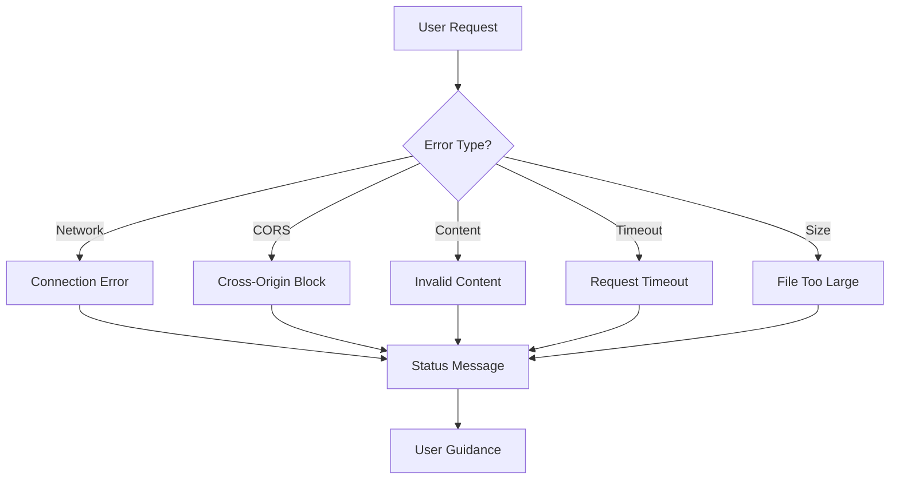

# Error Handling Demo

[← Back to Welcome](/?sample) | [About](/?url=docs/about.md)

---

This page demonstrates how Merview handles various error conditions gracefully. Understanding these errors helps you troubleshoot issues when loading content.



---

## Types of Errors

### 1. CORS Errors

**What It Is:** Cross-Origin Resource Sharing (CORS) errors occur when a server doesn't allow requests from different domains.

**When It Happens:**
- Loading from a server without CORS headers
- Servers that only allow same-origin requests

**What You'll See:**
```
CORS error: The server doesn't allow cross-origin requests.
See CORS Configuration Guide for solutions.
```

**Solutions:**
- Use sources that support CORS (GitHub, CDNs)
- Configure CORS headers on your own server
- See [CORS Configuration Guide](/?url=docs/cors-configuration.md)

---

### 2. Network Errors

**What It Is:** Network errors occur when the content can't be fetched.

**When It Happens:**
- Server is down or unreachable
- Invalid URL
- DNS resolution failure
- Network connectivity issues

**What You'll See:**
```
Error loading URL: Failed to fetch
```

**Solutions:**
- Check the URL is correct
- Verify the server is online
- Check your internet connection

---

### 3. HTTP Errors

**What It Is:** HTTP errors are returned by the server indicating a problem.

**Common Errors:**

| Code | Meaning | Solution |
|------|---------|----------|
| 404 | Not Found | Check URL path is correct |
| 403 | Forbidden | File may require authentication |
| 500 | Server Error | Server-side issue, try again later |
| 502 | Bad Gateway | Proxy or CDN issue |

**What You'll See:**
```
Error loading URL: HTTP 404
```

---

### 4. Timeout Errors

**What It Is:** Timeout errors occur when the server takes too long to respond.

**When It Happens:**
- Slow server response
- Large files on slow connections
- Server under heavy load

**What You'll See:**
```
Error loading URL: Request timed out (10s limit)
```

**Solutions:**
- Try again later
- Check if the server is responsive
- Use a CDN-hosted copy if available

---

### 5. Content Type Errors

**What It Is:** Content type errors occur when the server returns non-text content.

**When It Happens:**
- URL points to a binary file
- Server returns HTML wrapper instead of raw markdown
- Wrong file type

**What You'll See:**
```
Invalid content type: expected text
```

**Solutions:**
- Use the "Raw" button on GitHub
- Ensure URL points to actual markdown content
- Check the file extension

---

### 6. Size Limit Errors

**What It Is:** Size errors occur when the file exceeds Merview's 10MB limit.

**When It Happens:**
- Very large documentation files
- Files with embedded binary data
- Accidentally loading non-text content

**What You'll See:**
```
File too large (XXmB, max 10MB)
```

**Solutions:**
- Split large documents into smaller files
- Remove embedded media
- Link to external resources instead

---

### 7. URL Validation Errors

**What It Is:** URL validation errors occur before any network request is made.

**Common Issues:**

| Problem | Error Message |
|---------|---------------|
| HTTP instead of HTTPS | Must use HTTPS |
| URL too long | Exceeds 8,000 character limit |
| Credentials in URL | Warning about private URL |
| Invalid format | URL format not recognized |

---

## Mermaid Diagram Errors

Invalid Mermaid syntax displays an error in place of the diagram:

### Invalid Syntax Example

> **Expected Result:** The code block below should display as a **red error box** - this is intentional to demonstrate error handling!

```mermaid
graph TD
    A[Start --> B[End]
```

The diagram above has a syntax error (missing closing bracket on "Start"). This is what Mermaid errors look like in Merview.

### Common Mermaid Errors

| Error | Cause | Solution |
|-------|-------|----------|
| Syntax error | Invalid diagram syntax | Check brackets, arrows, quotes |
| Unknown diagram type | Typo in diagram type | Use valid types: graph, sequenceDiagram, etc. |
| Parse error | Special characters | Escape or quote special characters |

---

## Private URL Detection

If you paste a URL containing authentication tokens:

```
https://raw.githubusercontent.com/user/repo/main/file.md?token=ABC123XYZ
```

Merview will:
1. **Detect the token** - Pattern matching identifies credentials
2. **Show a warning** - Modal explains the security risk
3. **Require confirmation** - You must explicitly approve loading
4. **Suggest alternatives** - Recommends using public URLs or Gist sharing

---

## Testing Error Handling

Try these URLs to see error handling in action:

### CORS Error (Example)
```
?url=https://example.com/no-cors.md
```
Most websites don't have CORS headers configured.

### 404 Error
```
?url=https://raw.githubusercontent.com/nonexistent/repo/main/missing.md
```
This URL doesn't exist and returns a 404.

### Timeout (Hard to Test)
Requires a very slow server that takes >10 seconds to respond.

---

## Error Recovery

Merview doesn't lose your work when errors occur:

- **Current content preserved** - Your editor content isn't cleared on load failure
- **Auto-save continues** - localStorage backup keeps working
- **Clear status messages** - Errors are shown briefly, then clear

---

## Getting Help

If you encounter persistent errors:

1. **Check the URL** - Ensure it's correct and accessible
2. **Try a known-good URL** - Test with GitHub raw files
3. **Check browser console** - More detailed error information
4. **Report issues** - [GitHub Issues](https://github.com/mickdarling/merview/issues)

---

## Navigation

- [← Back to Welcome](/?sample)
- [Code Validation Demo](/?url=docs/demos/code-validation.md)
- [International Text Demo](/?url=docs/demos/international-text.md)
- [YAML Front Matter Demo](/?url=docs/demos/yaml-front-matter.md)
- [CORS Configuration Guide](/?url=docs/cors-configuration.md)
