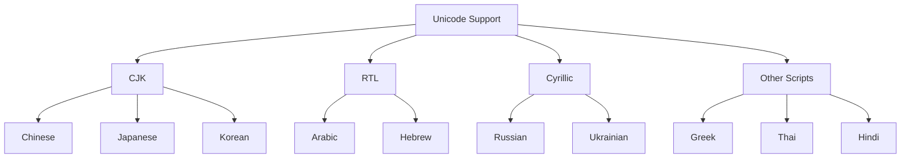
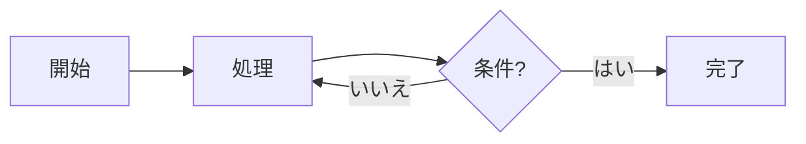
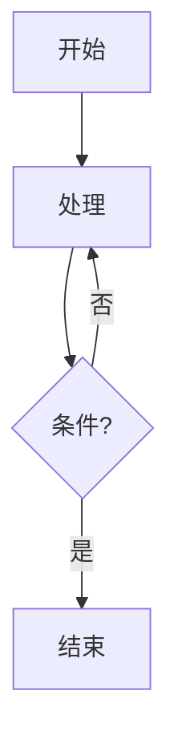

# International Language Support

[← Back to Welcome](/?sample) | [About](/?url=docs/about.md)

---

Merview fully supports international text, including CJK characters, RTL languages, Cyrillic, and more. This page demonstrates proper rendering of content in multiple languages.



---

## CJK Languages (Chinese, Japanese, Korean)

### Chinese (Simplified)

# 欢迎使用 Merview

这是一个支持 Mermaid 图表的 Markdown 编辑器。

**功能特点：**
- 实时预览
- 语法高亮
- PDF 导出
- 37 种主题

### Chinese (Traditional)

# 歡迎使用 Merview

這是一個支援 Mermaid 圖表的 Markdown 編輯器。

**功能特點：**
- 即時預覽
- 語法突顯
- PDF 匯出
- 37 種主題

### Japanese

# Merview へようこそ

Mermaid ダイアグラムをサポートする Markdown エディターです。

**主な機能：**
- リアルタイムプレビュー
- シンタックスハイライト
- PDF エクスポート
- 37 テーマ

日本語のテキストレンダリングをテストします。漢字、ひらがな、カタカナがすべて正しく表示されます。

### Korean

# Merview에 오신 것을 환영합니다

Mermaid 다이어그램을 지원하는 Markdown 편집기입니다.

**주요 기능:**
- 실시간 미리보기
- 구문 강조
- PDF 내보내기
- 37가지 테마

---

## Right-to-Left Languages

**Note:** RTL languages like Arabic and Hebrew require the `dir="rtl"` attribute for proper right-to-left alignment. In standard Markdown, text direction follows the browser's Unicode bidirectional algorithm, which handles character order but not paragraph alignment.

### Arabic

<div dir="rtl">

# مرحبًا بك في Merview

هذا محرر Markdown يدعم مخططات Mermaid.

**الميزات الرئيسية:**
- معاينة في الوقت الفعلي
- تمييز بناء الجملة
- تصدير PDF
- 37 سمة

النص العربي يُعرض بشكل صحيح من اليمين إلى اليسار.

</div>

### Hebrew

<div dir="rtl">

# ברוכים הבאים ל-Merview

זהו עורך Markdown התומך בתרשימי Mermaid.

**תכונות עיקריות:**
- תצוגה מקדימה בזמן אמת
- הדגשת תחביר
- ייצוא PDF
- 37 ערכות נושא

טקסט בעברית מוצג כראוי מימין לשמאל.

</div>

---

## Cyrillic Languages

### Russian

# Добро пожаловать в Merview

Это редактор Markdown с поддержкой диаграмм Mermaid.

**Основные возможности:**
- Предпросмотр в реальном времени
- Подсветка синтаксиса
- Экспорт в PDF
- 37 тем оформления

### Ukrainian

# Ласкаво просимо до Merview

Це редактор Markdown з підтримкою діаграм Mermaid.

**Основні можливості:**
- Попередній перегляд у реальному часі
- Підсвічування синтаксису
- Експорт у PDF
- 37 тем оформлення

---

## Other Scripts

### Greek

# Καλώς ήρθατε στο Merview

Αυτός είναι ένας επεξεργαστής Markdown με υποστήριξη διαγραμμάτων Mermaid.

### Thai

# ยินดีต้อนรับสู่ Merview

นี่คือตัวแก้ไข Markdown ที่รองรับไดอะแกรม Mermaid

### Hindi

# Merview में आपका स्वागत है

यह एक Markdown संपादक है जो Mermaid डायग्राम का समर्थन करता है।

### Vietnamese

# Chào mừng đến với Merview

Đây là trình soạn thảo Markdown hỗ trợ sơ đồ Mermaid.

---

## Mixed Language Table

| Language | Hello | Thank You |
|----------|-------|-----------|
| English | Hello | Thank you |
| Chinese | 你好 | 谢谢 |
| Japanese | こんにちは | ありがとう |
| Korean | 안녕하세요 | 감사합니다 |
| Arabic | مرحبا | شكرا |
| Hebrew | שלום | תודה |
| Russian | Привет | Спасибо |
| Greek | Γεια σου | Ευχαριστώ |
| Thai | สวัสดี | ขอบคุณ |
| Hindi | नमस्ते | धन्यवाद |

---

## Mermaid with International Text





---

## Code with International Comments

```javascript
// 这是一个JavaScript函数
// これはJavaScript関数です
function greet(name) {
    // 返回问候语 / 挨拶を返す
    return `Hello, ${name}!`;
}
```

```python
# 파이썬 예제 코드
# ตัวอย่างโค้ด Python
def fibonacci(n):
    """Вычисляет n-е число Фибоначчи"""
    if n <= 1:
        return n
    return fibonacci(n-1) + fibonacci(n-2)
```

---

## International Domain Names (IDN)

Merview supports loading content from international domain names:

- `https://例え.jp/docs/readme.md` - Japanese domain
- `https://münchen.de/info.md` - German umlaut
- `https://москва.ru/документ.md` - Russian domain

**Security Note:** Homograph attacks (mixing scripts to spoof domains) are blocked.

---

## Navigation

- [← Back to Welcome](/?sample)
- [Code Validation Demo](/?url=docs/demos/code-validation.md)
- [YAML Front Matter Demo](/?url=docs/demos/yaml-front-matter.md)
- [Error Handling Demo](/?url=docs/demos/error-handling.md)
