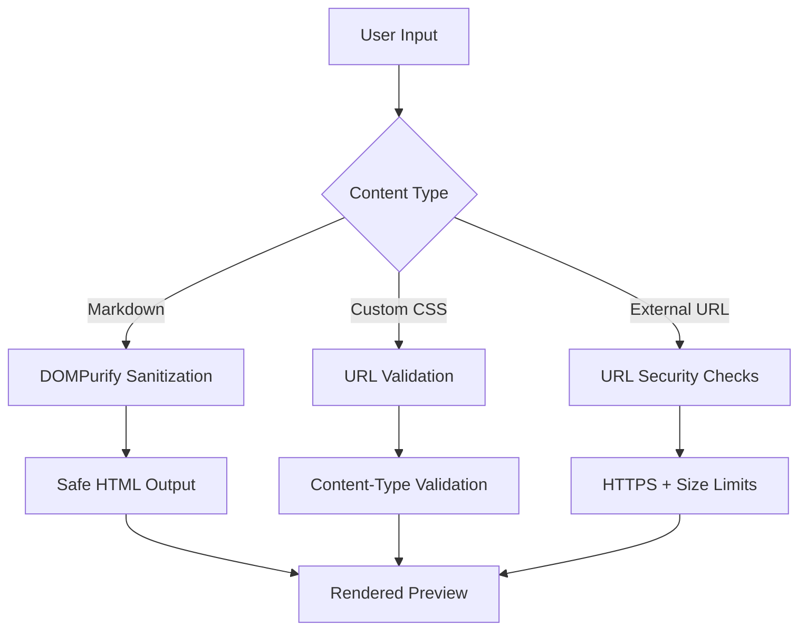
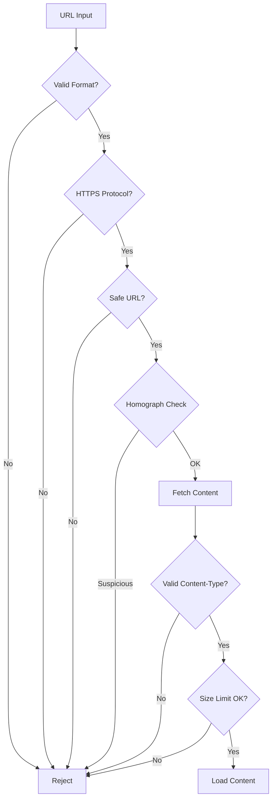

# Security

[← Back to Welcome](/?sample)

---

Merview is designed with security as a core principle. This document explains our security model and the protections in place.

---

## Privacy-First Architecture

### Everything Runs Locally

Merview processes everything in your browser:

- **No server uploads** - Your documents never leave your machine
- **No analytics** - We don't track what you write or view
- **No accounts** - No personal data collected
- **LocalStorage only** - Auto-save stays on your device

### What We Don't Collect (Currently)

| Data Type | Collected? |
|-----------|------------|
| Document content | ❌ No |
| Usage analytics | ❌ No (see note below) |
| Personal info | ❌ No |
| IP addresses | ❌ No |
| Browser fingerprints | ❌ No |

**Future Analytics Note:** We're considering adding [privacy-respecting analytics](https://github.com/mickdarling/merview/issues/74) following the Wikimedia Foundation model—aggregate counts only (page loads, feature usage) with no personal identifiers, no IP logging, and no tracking cookies. Any such implementation would be transparent and documented here.

---

## XSS Protection

### HTML Sanitization

All rendered HTML passes through [DOMPurify](https://github.com/cure53/DOMPurify):

- Strips malicious scripts
- Removes dangerous attributes
- Allows safe HTML elements only

### Content Security Policy

Our CSP headers restrict:

- Inline scripts (blocked)
- External script sources (allowlisted only)
- Frame embedding (restricted)

---

## URL Loading Security

When loading content from URLs, multiple protections apply:

### Open URL Support

Merview supports loading markdown from **any HTTPS URL** for maximum flexibility:

- **No Domain Restrictions** - Load from any public HTTPS source
- **GitHub Integration** - Automatic URL normalization for gist.github.com and github.com/blob URLs
- **HTTPS Required** - All URLs must use secure HTTPS protocol

### Content-Type Validation

- Text content types accepted (text/plain, text/markdown, etc.)
- Binary files are rejected
- Dangerous types blocked (javascript, vbscript, etc.)

### International Domain Name (IDN) Support

Merview supports international domain names while protecting against attacks:

- **IDN Allowed** - Domains like `例え.jp` or `münchen.de` work correctly
- **Homograph Protection** - Mixed-script attacks are blocked (e.g., domains mixing Cyrillic and Latin characters)
- **Unicode Normalization** - Proper handling of international characters

### URL Validation

- **HTTPS required** - Protects content in transit
- **Maximum URL length** - 8,000 character limit
- **10MB size limit** - Prevents loading extremely large files
- **10 second timeout** - Prevents hanging on slow endpoints
- **Credential detection** - Warns if URL contains authentication tokens
- **Homograph detection** - Blocks mixed-script domain attacks

---

## Private URL Detection

If you paste a URL containing authentication tokens:

1. **Warning displayed** - Modal explains the risk
2. **Token shown** - So you can verify what was detected
3. **Choice given** - Continue or cancel
4. **No automatic loading** - You must explicitly approve

This protects against accidentally sharing private URLs.

---

## Gist Sharing Security

When sharing via GitHub Gist:

- **OAuth flow** - Secure GitHub authentication
- **Minimal permissions** - Only gist:create scope
- **Token handling** - Tokens stored securely, expire appropriately
- **No plaintext storage** - Sensitive data protected

---

## YAML Front Matter Security

Merview renders YAML front matter (document metadata) with security hardening:

- **Safe Parsing** - Simple key-value parser with no code execution
- **Dangerous Patterns Blocked** - YAML anchors (`&`), aliases (`*`), and custom tags (`!`) are rejected
- **Size Limits** - Maximum 100 keys, 500 array items, 10,000 character values
- **XSS Protected** - All values are HTML-escaped before rendering

---

## CORS Error Handling

When loading content fails due to CORS restrictions:

- **Helpful Error Messages** - Clear explanation of why content couldn't be loaded
- **Configuration Guidance** - Links to CORS configuration documentation
- **No Silent Failures** - All errors are communicated to the user

See the [CORS Configuration Guide](/?url=docs/cors-configuration.md) for server setup instructions.

---

## Reporting Security Issues

Found a vulnerability? Please report responsibly:

1. **Don't open a public issue** for security bugs
2. **Email directly** or use GitHub's private reporting
3. **Include details** - Steps to reproduce, impact assessment
4. **Allow time** - We'll respond within 48 hours

---

## Security Updates

We actively maintain security:

- Dependencies regularly updated
- Security advisories monitored
- Vulnerabilities patched promptly
- [SonarCloud](https://sonarcloud.io/project/overview?id=mickdarling_merview) analysis on all PRs

---

## Third-Party Dependencies

| Library | Purpose | Security Notes |
|---------|---------|----------------|
| DOMPurify | HTML sanitization | Industry standard XSS protection |
| marked | Markdown parsing | Configured for security |
| highlight.js | Syntax highlighting | No eval, safe transforms |
| Mermaid | Diagrams | Sandboxed rendering |
| CodeMirror | Editor | No security concerns |

---

## Navigation

- [← Back to Welcome](/?sample)
- [About Merview](/?url=docs/about.md)
- [Developer Kit](/?url=docs/developer-kit.md)
- [Theme Guide](/?url=docs/themes.md)
- [Contributing](/?url=docs/contributing.md)
- [Support the Project](/?url=docs/sponsor.md)
