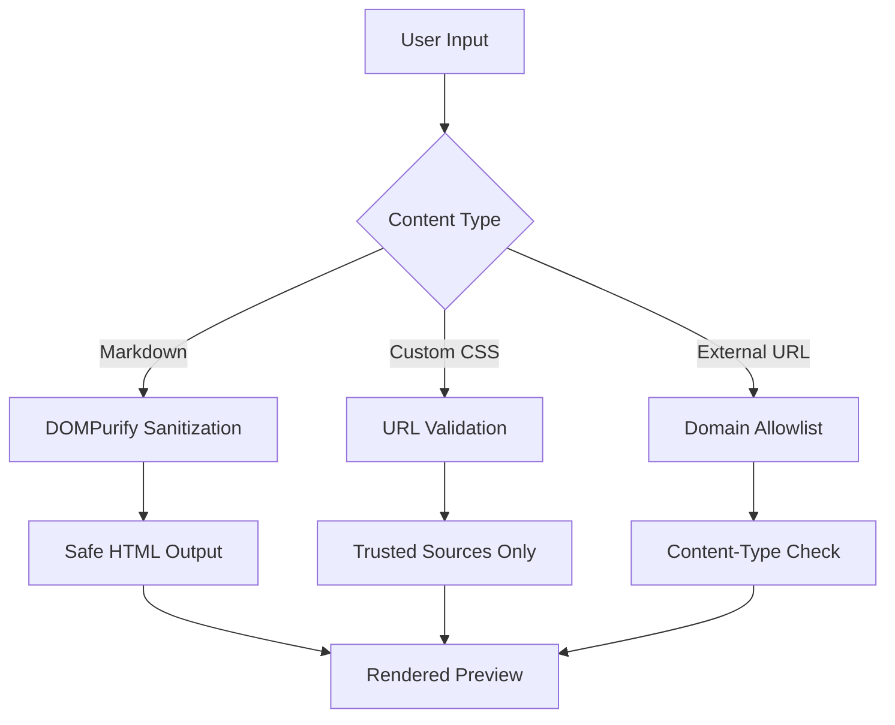
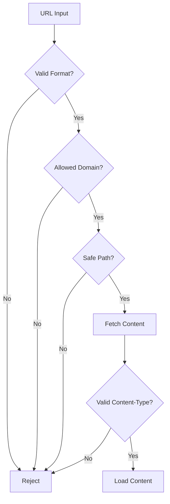

# Security

[← Back to Welcome](https://merview.com)

---

Merview is designed with security as a core principle. This document explains our security model and the protections in place.



---

## Privacy-First Architecture

### Everything Runs Locally

Merview processes everything in your browser:

- **No server uploads** - Your documents never leave your machine
- **No analytics** - We don't track what you write or view
- **No accounts** - No personal data collected
- **LocalStorage only** - Auto-save stays on your device

### What We Don't Collect

| Data Type | Collected? |
|-----------|------------|
| Document content | ❌ No |
| Usage analytics | ❌ No |
| Personal info | ❌ No |
| IP addresses | ❌ No |
| Browser fingerprints | ❌ No |

---

## XSS Protection

### HTML Sanitization

All rendered HTML passes through [DOMPurify](https://github.com/cure53/DOMPurify):

- Strips malicious scripts
- Removes dangerous attributes
- Allows safe HTML elements only

### Content Security Policy

Our CSP headers restrict:

- Inline scripts (blocked)
- External script sources (allowlisted only)
- Frame embedding (restricted)

---

## URL Loading Security

When loading content from URLs, multiple protections apply:

### Domain Allowlist

Only these trusted sources are permitted:

```
✅ raw.githubusercontent.com
✅ gist.githubusercontent.com
✅ cdn.jsdelivr.net
✅ unpkg.com
✅ cdnjs.cloudflare.com
```

All other domains are blocked.

### Content-Type Validation

- CSS files must return `text/css`
- Markdown files must return text content types
- Binary files are rejected

### URL Validation



- Maximum URL length enforced
- Path traversal attempts blocked
- Credential patterns detected and warned

---

## Private URL Detection

If you paste a URL containing authentication tokens:

1. **Warning displayed** - Modal explains the risk
2. **Token shown** - So you can verify what was detected
3. **Choice given** - Continue or cancel
4. **No automatic loading** - You must explicitly approve

This protects against accidentally sharing private URLs.

---

## Gist Sharing Security

When sharing via GitHub Gist:

- **OAuth flow** - Secure GitHub authentication
- **Minimal permissions** - Only gist:create scope
- **Token handling** - Tokens stored securely, expire appropriately
- **No plaintext storage** - Sensitive data protected

---

## Reporting Security Issues

Found a vulnerability? Please report responsibly:

1. **Don't open a public issue** for security bugs
2. **Email directly** or use GitHub's private reporting
3. **Include details** - Steps to reproduce, impact assessment
4. **Allow time** - We'll respond within 48 hours

---

## Security Updates

We actively maintain security:

- Dependencies regularly updated
- Security advisories monitored
- Vulnerabilities patched promptly
- [SonarCloud](https://sonarcloud.io/project/overview?id=mickdarling_merview) analysis on all PRs

---

## Third-Party Dependencies

| Library | Purpose | Security Notes |
|---------|---------|----------------|
| DOMPurify | HTML sanitization | Industry standard XSS protection |
| marked | Markdown parsing | Configured for security |
| highlight.js | Syntax highlighting | No eval, safe transforms |
| Mermaid | Diagrams | Sandboxed rendering |
| CodeMirror | Editor | No security concerns |

---

## Navigation

- [← Back to Welcome](https://merview.com)
- [About Merview](https://merview.com/?url=https://raw.githubusercontent.com/mickdarling/merview/main/docs/about.md)
- [Theme Guide](https://merview.com/?url=https://raw.githubusercontent.com/mickdarling/merview/main/docs/themes.md)
- [Contributing](https://merview.com/?url=https://raw.githubusercontent.com/mickdarling/merview/main/docs/contributing.md)
- [Support the Project](https://merview.com/?url=https://raw.githubusercontent.com/mickdarling/merview/main/docs/sponsor.md)
