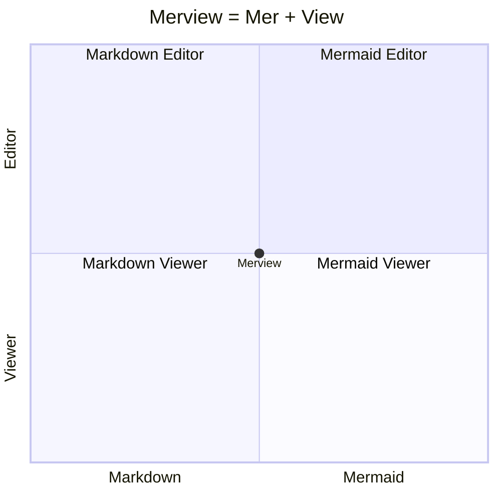

# Session Notes: Merview Rebrand and Deployment

**Date:** November 30, 2025 (Afternoon)
**Duration:** ~2.5 hours
**Focus:** Rebrand from MerDown to Merview, GitHub Pages deployment, open source prep

---

## Summary

Completed the rebrand from MerDown to Merview and successfully deployed to merview.com via GitHub Pages with Cloudflare DNS.

---

## What is Merview?



**Merview** sits at the intersection of:
- **Mermaid** + **Markdown** (content types)
- **Editor** + **Viewer** (functionality)

The name passes the telephone test: someone hearing "Merview" can spell it correctly (like "Mermaid View").

---

## Completed Tasks

### 1. Open Source Prep (Issues #21, #22)
- ✅ Created GitHub issue and PR templates
- ✅ Configured repository settings (topics, homepage, discussions enabled)
- ✅ Verified labels exist (bug, enhancement)

### 2. GitHub Pages Setup (Issue #38)
- ✅ Enabled GitHub Pages (deploy from main branch)
- ✅ Fixed missing editor theme CSS files (PR #43)
- ✅ Added favicon.png

### 3. Rebrand to Merview (Issue #46, PR #47)

**Rationale:**
- "MerDown" sounds like a downer, not pleasant to say
- "Merview" passes the telephone test
- Clear etymology: Mermaid + View

**Files Updated:**
| File | Changes |
|------|---------|
| `index.html` | Title, header, logo alt, GitHub links, sample document |
| `README.md` | Title, docker commands |
| `CONTRIBUTING.md` | All references (~15) |
| `CHANGELOG.md` | Branding, release URLs |
| `CODE_OF_CONDUCT.md` | Issues URL |
| `SECURITY.md` | All project references |
| `package.json` | Package name, docker scripts |
| `.github/ISSUE_TEMPLATE/config.yml` | GitHub URLs |
| `CNAME` | New file: merview.com |
| `favicon.png` | New file: browser icon |

### 4. Domain and DNS Configuration
- ✅ Purchased merview.com domain
- ✅ Configured Cloudflare DNS:
  - 4x A records pointing to GitHub Pages IPs (DNS only mode)
  - CNAME for www subdomain
  - Email routing to Gmail via Cloudflare Email Routing
- ✅ Set custom domain in GitHub Pages settings
- ✅ Enabled HTTPS enforcement

### 5. Trademark Research
- Researched Mermaid.js trademark status
- Found 50+ third-party products using "Mermaid" in their names
- No evidence of cease & desist actions
- Conclusion: Low risk, Mermaid ecosystem encourages integrations

---

## New Issues Created

| Issue | Title | Priority |
|-------|-------|----------|
| #38 | Set up GitHub Pages deployment | High (Done) |
| #39 | Redesign sample document as About page | High |
| #41 | Enable GitHub Discussions | Low (Done) |
| #42 | Verify labels exist | Low (Done) |
| #44 | Add Playwright tests for theme loading | Medium |
| #46 | Rebrand to Merview | High (Done) |

---

## PRs Merged

| PR | Title |
|----|-------|
| #40 | Add GitHub issue and PR templates |
| #43 | Add missing editor theme CSS files |
| #47 | Rebrand from MerDown to Merview |

---

## Current State

**Live Site:** https://merview.com ✅

**GitHub Repo:** https://github.com/mickdarling/merview

**Features Working:**
- Editor with 6 syntax themes
- Preview with 6+ document styles
- 12 code syntax highlighting themes
- Mermaid diagram rendering
- Save/Load/Export functionality
- Favicon displays correctly

---

## Remaining Open Issues

### High Priority (Pre-Launch)
| Issue | Title | Notes |
|-------|-------|-------|
| #17 | README polish | Screenshots, badges, live demo link |
| #39 | Redesign sample doc as About page | Make sample document the documentation |

### Medium Priority
| Issue | Title | Notes |
|-------|-------|-------|
| #30 | Accessibility audit | WCAG compliance check |
| #44 | Playwright tests for theme loading | Visual regression testing |

### Lower Priority
| Issue | Title | Notes |
|-------|-------|-------|
| #25 | Add license headers to source files | AGPL compliance |
| #29 | Enhance THIRD-PARTY-NOTICES.md | Better attribution |
| #31 | Internationalization support | i18n for UI strings |

---

## Next Session Recommendations

### 1. Sample Document as Documentation (#39)
The sample document should serve as the About page and user guide. This is elegant dogfooding: the documentation demonstrates the product.

**Content to include:**
- What is Merview? (with the quadrant chart!)
- Quick start guide
- Feature documentation (all themes, keyboard shortcuts)
- Mermaid diagram examples
- Links to GitHub, changelog

### 2. README Polish (#17)
Once the sample doc is done, the README can be simplified:
- Add badges (license, version)
- Add screenshot or GIF
- Link to live demo at merview.com
- Keep it concise, point to live app for full docs

### 3. Consider for Launch
- Create v1.0.0 GitHub Release
- Prepare Hacker News post
- Test on mobile browsers
- Run accessibility audit (#30)

---

## Technical Notes

### GitHub Pages + Cloudflare Setup
- DNS must be "DNS only" (gray cloud), not "Proxied" (orange cloud)
- GitHub needs to issue SSL certificate, can't do that through Cloudflare proxy
- CNAME file in repo root tells GitHub Pages the custom domain

### Repo Rename Process
- GitHub redirects are automatic and permanent
- Exception: GitHub Pages URLs don't redirect (but custom domain solves this)
- Update local git remote: `git remote set-url origin https://github.com/mickdarling/merview.git`

---

## Commands Reference

```bash
# Update git remote after repo rename
git remote set-url origin https://github.com/mickdarling/merview.git

# Docker commands (updated for Merview)
docker build -t merview:latest .
docker run -d -p 8080:80 --name merview merview:latest

# Local development
npm start  # Opens http://localhost:8080
```

---

## Session Artifacts

- Screenshot: Merview quadrant chart rendering
- Comprehensive rebrand issue (#46) with full checklist
- All documentation updated to Merview branding

---

**End of Session**

*Site is live at https://merview.com* 🎉
