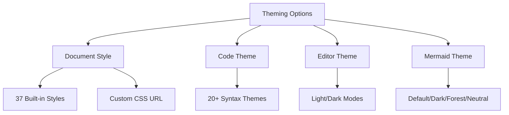
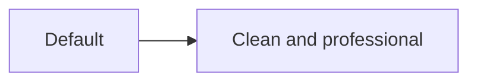

# Theme Guide

[← Back to Welcome](https://merview.com)

---

Merview offers extensive theming options to make your documents look exactly how you want them. There are three types of themes you can customize:



---

## Document Styles

The **Style** dropdown controls the overall look of your rendered document. Choose from 37 professional styles:

### Popular Choices

| Style | Best For |
|-------|----------|
| **Clean** | General purpose, minimal design |
| **Academic** | Research papers, formal documents |
| **GitHub** | README files, developer docs |
| **Torpedo** | Creative, modern documents |
| **Dark** | Low-light environments |
| **Monospace** | Technical documentation |

### Full Style List

**Light Themes:**
- Clean, Academic, GitHub, Torpedo, Newsprint
- Antique, Cafe Noir, Metro, Metro Serif
- Chocolate, Cobalt, Espresso, Florid, Gazette
- Kacit, Letter, Linen, Manuscript, Pannam
- Peacock, Quartz, Solarized, Spring, Steampunk
- Swiss, Typed, Victorian, Whitey

**Dark Themes:**
- Dark, GitHub Dark, Academic Dark

### Using Custom CSS

You can load any CSS file from a URL:

1. Click **"Load Style from URL"**
2. Enter the URL to your CSS file
3. The style is applied immediately

**Trusted sources for CSS:**
- `raw.githubusercontent.com` - GitHub raw files
- `cdn.jsdelivr.net` - jsDelivr CDN
- `unpkg.com` - unpkg CDN
- `cdnjs.cloudflare.com` - Cloudflare CDN
- `gist.githubusercontent.com` - GitHub Gists

---

## Code Syntax Themes

The **Code Theme** dropdown controls how code blocks are highlighted:

```javascript
// This code block uses your selected theme
function example() {
    const message = "Hello, World!";
    console.log(message);
    return true;
}
```

### Available Code Themes

| Theme | Style |
|-------|-------|
| **GitHub** | Light, familiar |
| **GitHub Dark** | Dark mode GitHub |
| **VS2015** | Visual Studio dark |
| **Monokai** | Classic dark theme |
| **Atom One Dark** | Atom editor style |
| **Atom One Light** | Light Atom style |
| **Nord** | Arctic, bluish dark |
| **Tokyo Night Dark** | Purple-tinted dark |
| **Tokyo Night Light** | Soft light theme |
| **Solarized Dark** | Warm dark theme |
| **Solarized Light** | Warm light theme |
| **Gruvbox Dark** | Retro dark |
| **Gruvbox Light** | Retro light |
| **Night Owl** | Dark blue theme |
| **Obsidian** | Dark gray theme |
| **Agate** | Minimal dark |

---

## Editor Themes

The **Editor Theme** dropdown (gear icon area) controls the editing pane appearance:

- **Light themes** - Default, Eclipse, Elegant
- **Dark themes** - Material, Dracula, Monokai, Nord
- **High contrast** - For accessibility needs

---

## Mermaid Diagram Themes

The **Mermaid Theme** dropdown controls diagram styling:

### Default


### Dark
Best paired with dark document styles.

### Forest
Green-tinted, nature-inspired.

### Neutral
Grayscale, minimal distraction.

---

## Theme Combinations

Here are some recommended combinations:

| Document | Code | Mermaid | Use Case |
|----------|------|---------|----------|
| Clean | GitHub | Default | General purpose |
| Academic | GitHub | Neutral | Papers, reports |
| GitHub | GitHub Dark | Default | Developer docs |
| Dark | Monokai | Dark | Night coding |
| Torpedo | Atom One Dark | Default | Creative projects |

---

## Tips

1. **Match light with light** - Pair light document styles with light code themes
2. **Consistency matters** - Use the same theme family across all settings
3. **Consider your audience** - Academic for formal, creative for portfolios
4. **Test before exporting** - Preview how themes look in PDF

---

## Navigation

- [← Back to Welcome](https://merview.com)
- [About Merview](https://merview.com/?url=https://raw.githubusercontent.com/mickdarling/merview/main/docs/about.md)
- [Security](https://merview.com/?url=https://raw.githubusercontent.com/mickdarling/merview/main/docs/security.md)
- [Contributing](https://merview.com/?url=https://raw.githubusercontent.com/mickdarling/merview/main/docs/contributing.md)
- [Support the Project](https://merview.com/?url=https://raw.githubusercontent.com/mickdarling/merview/main/docs/sponsor.md)
